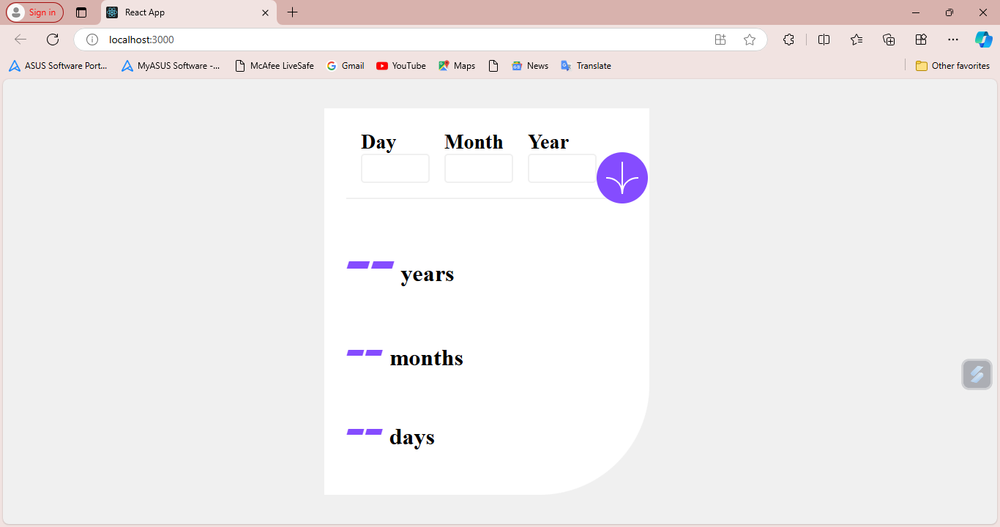
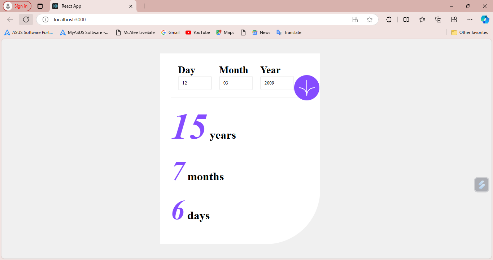

# Age Calculator App

This project is a solution to a Frontend Mentor challenge, built using React. It is an age calculator app that allows users to input their birth date and calculates their age in years, months, and days. The project also features simple validation to ensure valid inputs.

## Table of Contents

- [Overview](#overview)
- [Features](#features)
- [Installation](#installation)
- [Usage](#usage)
- [Built With](#built-with)
- [Acknowledgments](#acknowledgments)

## Overview

The **Age Calculator App** is a small application where users can enter their birth date and calculate their age based on the current date. It validates inputs for day, month, and year to ensure valid dates. If the inputs are valid, it displays the calculated age; otherwise, it shows an error message.

## run
 http://localhost:3000  

 ## Site 
 https://age-form-app.vercel.app/
 
## Screen shots



## Features

- Input fields for day, month, and year of birth.
- Validates inputs (e.g., day must be between 1-31, month between 1-12, and year cannot exceed the current year).
- Calculates and displays the age in years, months, and days.
- Shows a message if invalid inputs are provided.

## Installation

Follow these steps to set up the project locally:

1. **Cloned repository**:
   ```bash
   git clone https://github.com/Siphe23/age-form-app.git
